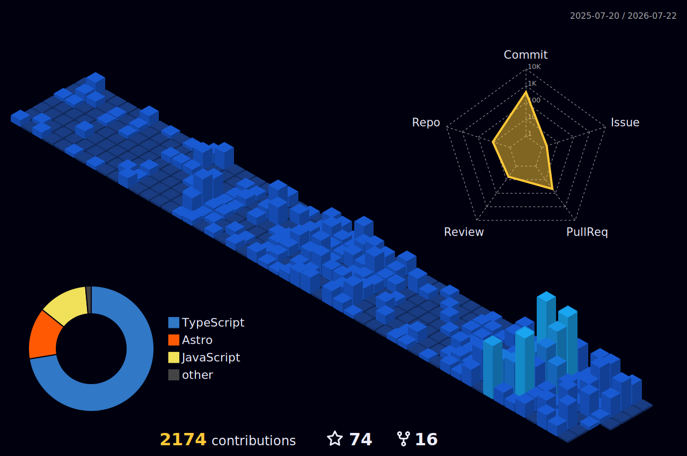

<h1 align="center">Salahudeen</h1>

Software Developer

  

  
  
  
  
  

  

---

### Tech

  
  
  
  
  
  

  
  
  
  
  
  
  

  Also: After Effects &middot; Premiere Pro &middot; Photoshop &middot; Illustrator &middot; Blender

---

### Contribution Graph

  

### Recent Activity &amp; Achievements

  
  

### GitHub Stats

  
  

  

